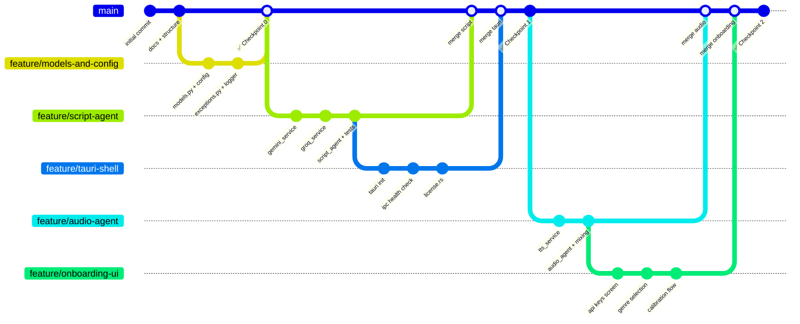
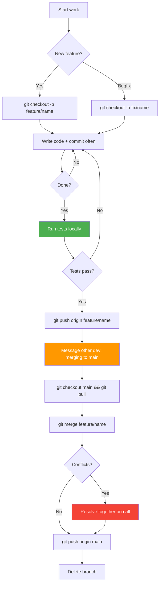
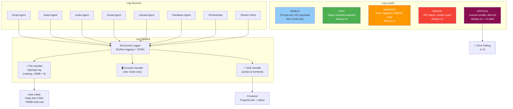

# Engineering Specifications — Part 1
## Repository Structure | Branching Strategy | Testing Levels | Logging & Observability

---

# 1. Repository Structure

```mermaid
graph TD
    ROOT["ytshortsauto/"] --> DOCS["docs/"]
    ROOT --> BACKEND["backend/"]
    ROOT --> FRONTEND["frontend/"]
    ROOT --> ASSETS["assets/ (git-ignored)"]
    ROOT --> GI[".gitignore"]
    ROOT --> README["README.md"]

    DOCS --> DP["planning/"]
    DOCS --> DR["research/"]
    DOCS --> DG["guides/"]

    DP --> FP["FINAL_PRODUCT.md"]
    DP --> PRD["PRD.md"]
    DP --> SA["SYSTEM_ARCHITECTURE.md"]
    DP --> DC["DEVELOPMENT_CONTRACT.md"]
    DP --> ES["ENGINEERING_SPECS_*.md"]

    BACKEND --> AGENTS["agents/"]
    BACKEND --> CORE["core/"]
    BACKEND --> SERVICES["services/"]
    BACKEND --> PIPELINE["pipeline/"]
    BACKEND --> TESTS["tests/"]
    BACKEND --> MAIN["main.py"]
    BACKEND --> REQ["requirements.txt"]

    AGENTS --> A1["script_agent.py"]
    AGENTS --> A2["asset_agent.py"]
    AGENTS --> A3["audio_agent.py"]
    AGENTS --> A4["visual_agent.py"]
    AGENTS --> A5["upload_agent.py"]
    AGENTS --> A6["feedback_agent.py"]

    CORE --> M["models.py ⚠️ SHARED"]
    CORE --> SH["sheets_client.py"]
    CORE --> CA["cache_manager.py"]
    CORE --> CF["config.py"]
    CORE --> LG["logger.py"]
    CORE --> ER["exceptions.py"]

    SERVICES --> S1["gemini_service.py"]
    SERVICES --> S2["groq_service.py"]
    SERVICES --> S3["tts_service.py"]
    SERVICES --> S4["image_service.py"]
    SERVICES --> S5["youtube_service.py"]
    SERVICES --> S6["freesound_service.py"]

    PIPELINE --> OR["orchestrator.py"]
    PIPELINE --> RG["regeneration.py"]
    PIPELINE --> SM["state_machine.py"]

    TESTS --> T1["test_script_agent.py"]
    TESTS --> T2["test_services.py"]
    TESTS --> T3["test_pipeline.py"]
    TESTS --> T4["conftest.py (fixtures)"]

    FRONTEND --> SRC["src/"]
    FRONTEND --> TAURI["src-tauri/"]
    FRONTEND --> PKG["package.json"]

    SRC --> PAGES["pages/"]
    SRC --> COMP["components/"]
    SRC --> API["api.js (IPC layer)"]
    SRC --> STY["styles/"]

    TAURI --> RUST["src/"]
    TAURI --> CARGO["Cargo.toml"]
    RUST --> R1["main.rs"]
    RUST --> R2["license.rs"]
    RUST --> R3["ipc.rs"]
    RUST --> R4["keyring.rs"]

    ASSETS --> AG["gameplay/ (~500MB)"]
    ASSETS --> AM["music/ (~90MB)"]
    ASSETS --> AS["sfx/ (~15MB)"]
    ASSETS --> AF["fonts/ (~5MB)"]

    style M fill:#ff6b6b,color:#fff
    style ASSETS fill:#666,color:#fff
```



### Ownership Rules

| Path | Owner | Rule |
|---|---|---|
| `backend/**` | Dev A | Dev B reads only |
| `frontend/**` | Dev B | Dev A reads only |
| `backend/core/models.py` | Dev A | **Both review changes** |
| `docs/**` | Both | Either can edit |
| `backend/tests/**` | Dev A | Must exist before merge |

---

# 2. Branching Strategy



### Branch Rules



### Naming Convention

| Branch Type | Pattern | Example |
|---|---|---|
| Feature | `feature/component-name` | `feature/script-agent` |
| Bug fix | `fix/short-description` | `fix/tts-timeout` |
| Hotfix | `hotfix/critical-issue` | `hotfix/license-crash` |
| Experiment | `exp/idea-name` | `exp/whisper-timestamps` |

### Commit Message Format
```
type: short description (max 72 chars)

- Detail about what changed
- Why this approach was chosen

Types: feat, fix, refactor, test, docs, chore
```

---

# 3. Testing Level Decision

```mermaid
graph TD
    subgraph "Testing Pyramid"
        direction TB
        E2E["🔺 End-to-End Tests<br/>2-3 critical paths<br/>Run: before release"]
        INT["🔶 Integration Tests<br/>Agent → Service → API<br/>Run: before merge to main"]
        UNIT["🟩 Unit Tests<br/>Every function, every model<br/>Run: every commit"]
    end

    subgraph "What Each Level Tests"
        E2E --> E1["Full pipeline: genre → script → TTS → images → render → MP4"]
        E2E --> E2["Onboarding: keys → genre → calibration → dashboard"]
        E2E --> E3["Regeneration: generate → regen → compare → upload"]

        INT --> I1["Script Agent: Gemini mock → validation → ScriptOutput"]
        INT --> I2["Audio Agent: TTS mock → SSML → timestamps → mix"]
        INT --> I3["Asset Agent: mock APIs → 7-tier fallback → cached"]
        INT --> I4["Sheets Client: mock API → cache → read genres"]
        INT --> I5["Pipeline: orchestrator → state transitions"]

        UNIT --> U1["Pydantic models: valid/invalid inputs"]
        UNIT --> U2["SSML builder: genre profiles → correct XML"]
        UNIT --> U3["Image scorer: keyword match + resolution"]
        UNIT --> U4["Audio mixer: ducking levels + LUFS"]
        UNIT --> U5["Caption builder: word timing → ASS format"]
        UNIT --> U6["Config loader: YAML → GenreConfig"]
    end

    style E2E fill:#f44336,color:white
    style INT fill:#FF9800,color:white
    style UNIT fill:#4CAF50,color:white
```



### Testing Rules

| Rule | Detail |
|---|---|
| **Unit tests required before merge** | Every function in `agents/` and `services/` must have tests |
| **Mocks for all external APIs** | Never call real Gemini/Groq/TTS in tests |
| **Fixtures in conftest.py** | Shared test data (sample scripts, genre configs) |
| **Test file naming** | `test_{module_name}.py` mirrors source |
| **Minimum coverage** | 80% for `agents/`, `services/`, `core/` |
| **Integration tests weekly** | Run full pipeline with real APIs once per week |

### What NOT to Test
- UI layout/styling (visual review only)
- FFmpeg internals (trust the binary, test our filter graph)
- Google Sheets API responses (mock them)

---

# 4. Logging & Observability Plan



### Log Format
```python
# Every log entry MUST include:
{
    "timestamp": "2026-03-01T14:30:00.123Z",
    "level": "INFO",
    "module": "script_agent",
    "job_id": "job_abc123",           # Links to specific generation
    "stage": "script_generation",
    "message": "Script generated successfully",
    "extra": {
        "genre": "scary_stories",
        "word_count": 128,
        "duration_ms": 4200,
        "retries": 0
    }
}
```

### What to Log at Each Level

| Level | When | Example |
|---|---|---|
| DEBUG | API request/response payloads | `Gemini prompt: {prompt[:200]}` |
| INFO | Stage start, completion, timing | `TTS completed in 3.2s, 128 words` |
| WARNING | Fallback triggered, retry attempt | `Pexels failed, falling back to Pixabay` |
| ERROR | API error, render failure, validation fail | `Groq validation failed: score 5.2 < 7.0` |
| CRITICAL | License invalid, disk full, unrecoverable | `Disk space <500MB, aborting render` |

### Observability Dashboard (in Settings → Logs)
```
┌──────────────────────────────────────────┐
│ 📊 Generation Log                        │
│ Job: job_abc123   Genre: scary_stories   │
│                                          │
│ ✅ Script     4.2s  (1 retry)            │
│ ✅ TTS        3.1s                       │
│ ⚠️ Images     6.8s  (Pexels → Pixabay)  │
│ ✅ Audio Mix  1.2s                       │
│ ✅ Captions   0.8s                       │
│ ✅ Render     92.3s                      │
│ Total: 108.4s                            │
│                                          │
│ [View Full Log] [Export Log]             │
└──────────────────────────────────────────┘
```
