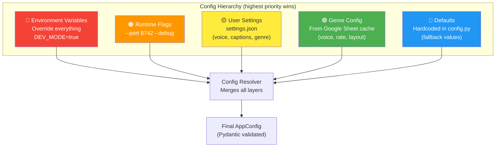
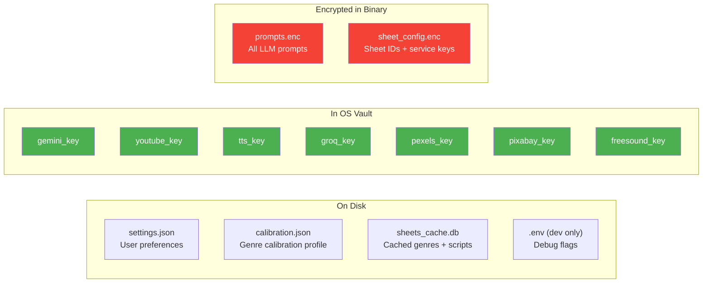
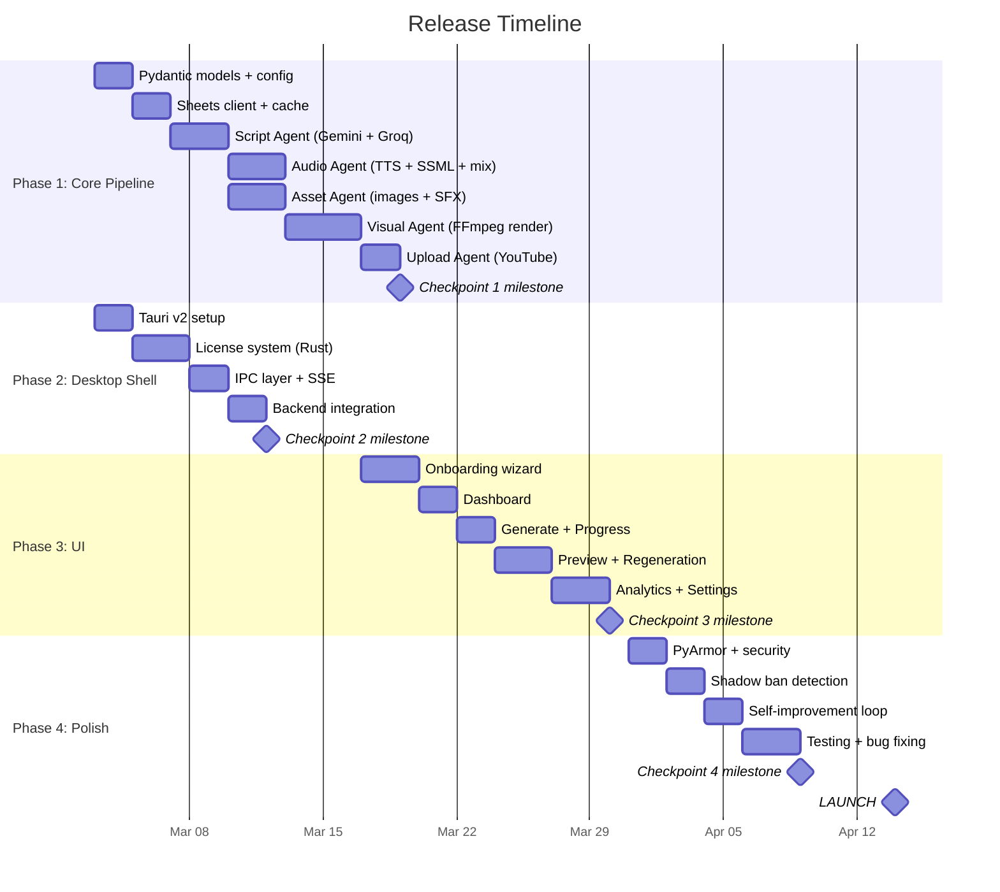
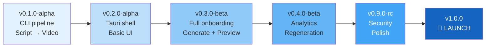
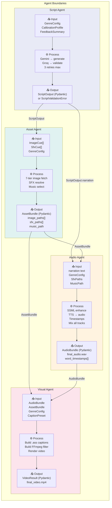
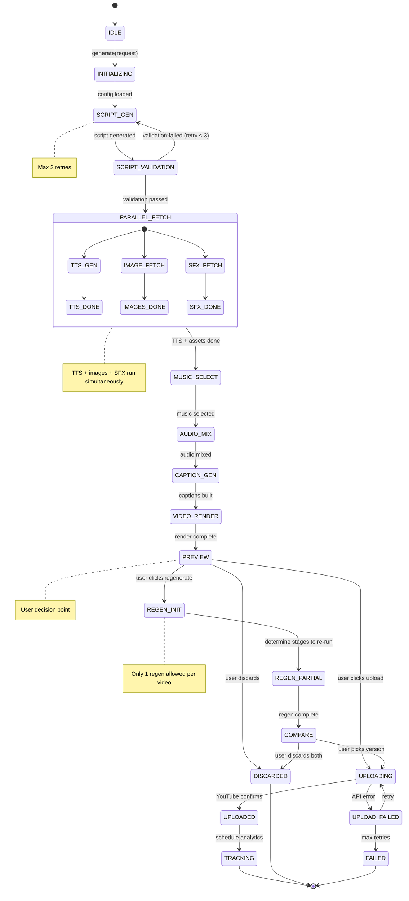

# Engineering Specifications — Part 2
## Config Management | Release Cadence | Agent Isolation | Orchestrator State Machine

---

# 5. Configuration Management Strategy



### Config Files Structure



### Config Pydantic Model

```python
class AppConfig(BaseModel):
    # Server
    port: int = 8742
    debug: bool = False
    
    # Paths
    data_dir: Path          # SQLite, calibration, cache
    assets_dir: Path        # Gameplay, music, SFX, fonts
    output_dir: Path        # Rendered videos
    logs_dir: Path          # Log files
    
    # Limits
    max_videos_per_day: int = 50
    max_videos_per_hour: int = 10
    max_concurrent: int = 2
    cache_refresh_hours: int = 24
    
    # Feature flags
    analytics_enabled: bool = True
    submissions_enabled: bool = True
    debug_logging: bool = False
```

### Rules

| Rule | Detail |
|---|---|
| **Never hardcode paths** | All paths via `AppConfig` + `pathlib.Path` |
| **Never hardcode API URLs** | Constants in `config.py` |
| **Settings changes = restart-free** | Hot-reload `settings.json` |
| **Genre config from sheet overrides local** | Sheet version wins if newer |
| **Dev vs Prod** | `DEV_MODE=true` enables debug logging + mock APIs |

---

# 6. Release Cadence Plan



### Release Versions



---

# 7. Agent Isolation Specification



### Isolation Rules

| Rule | Enforcement |
|---|---|
| **Agents NEVER call each other directly** | Only Orchestrator passes data between agents |
| **Agents NEVER share state** | No global variables, no shared files during execution |
| **Every input/output is Pydantic validated** | Type mismatch = immediate error, not silent corruption |
| **Agents can fail independently** | Script Agent crash → doesn't crash Audio Agent |
| **Retry is agent-internal** | Agent retries 3x before reporting failure to Orchestrator |
| **No agent imports another agent** | `script_agent.py` never imports from `audio_agent.py` |
| **Services are injected, not hardcoded** | `ScriptAgent(gemini_service, groq_service)` — testable with mocks |

### Dependency Injection Pattern

```python
# CORRECT — service injected, testable
class ScriptAgent:
    def __init__(self, gemini: GeminiService, groq: GroqService, cache: CacheManager):
        self.gemini = gemini
        self.groq = groq
        self.cache = cache

# WRONG — hardcoded, untestable
class ScriptAgent:
    def __init__(self):
        self.gemini = GeminiService(api_key=os.getenv("GEMINI_KEY"))
```

---

# 8. Orchestrator State Machine



### State Persistence

```python
class PipelineState(BaseModel):
    job_id: str
    state: str                    # Current state name
    genre_id: str
    created_at: datetime
    updated_at: datetime
    
    # Intermediate outputs (saved so partial re-runs work)
    script_output: ScriptOutput | None = None
    asset_bundle: dict | None = None          # Paths only 
    audio_bundle: dict | None = None          # Paths only
    caption_path: str | None = None
    video_path: str | None = None
    regen_video_path: str | None = None
    
    # Tracking
    retries: dict = {}           # {"script_generation": 2}
    errors: list[str] = []
    stage_timings: dict = {}     # {"script_generation": 4.2}
```

### State Transition Rules

| From | To | Condition |
|---|---|---|
| IDLE | INITIALIZING | `generate(request)` called |
| SCRIPT_VALIDATION | SCRIPT_GEN | `retries["script"] < 3` |
| SCRIPT_VALIDATION | FAILED | `retries["script"] >= 3` |
| PREVIEW | REGEN_INIT | `regenerations_remaining > 0` |
| PREVIEW | UPLOADING | User clicks upload |
| Any error state | FAILED | Max retries exceeded |

### Recovery: If App Crashes Mid-Pipeline

```
On app restart:
1. Load PipelineState from SQLite
2. If state == "VIDEO_RENDER" and temp file exists → resume render
3. If state == "TTS_GEN" → re-run from TTS (script is saved)
4. If state == "SCRIPT_GEN" → re-run from scratch
5. Show user: "Previous generation was interrupted. [Resume] [Start Over]"
```
