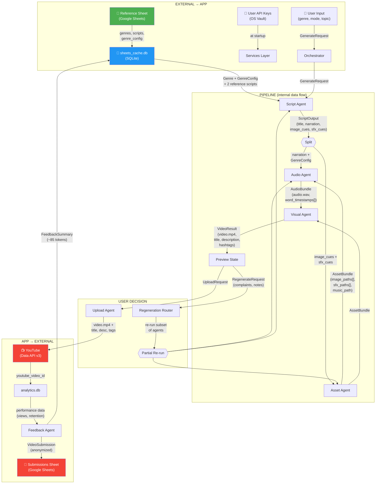
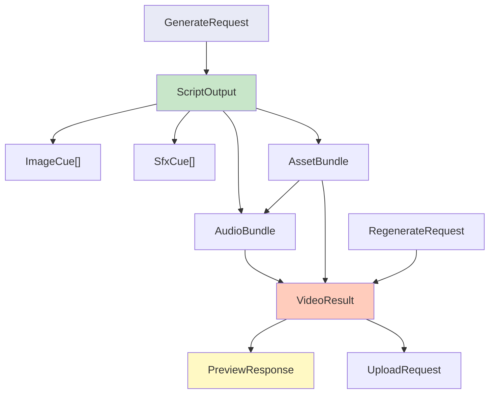
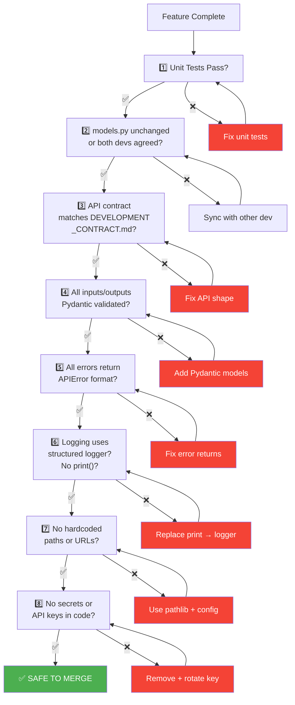
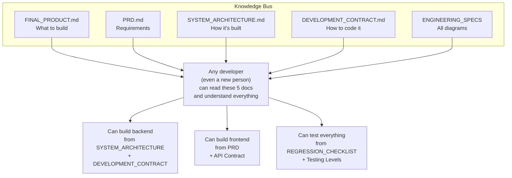
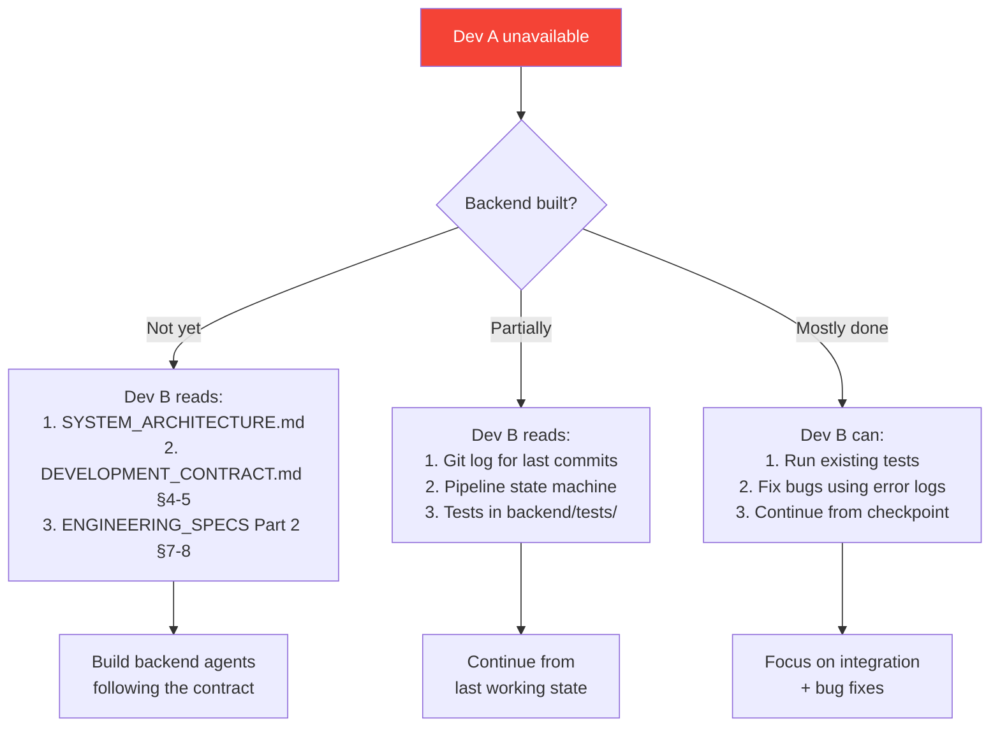
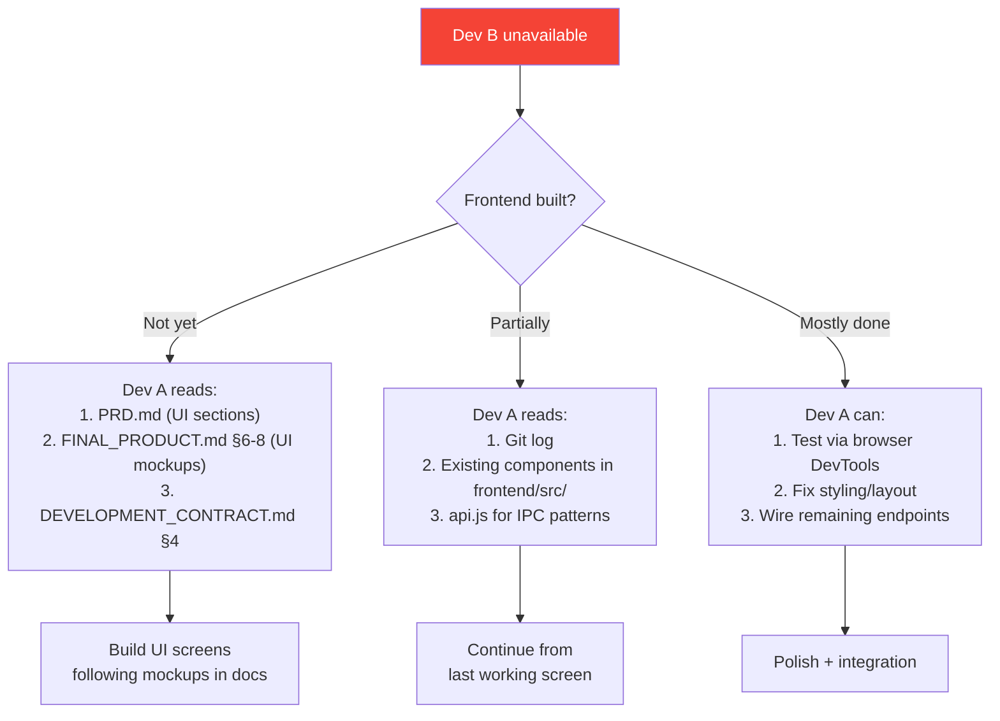

# Engineering Specifications — Part 3
## Data Contract Map | Regression Checklist | Single-Developer Continuity Plan

---

# 9. Data Contract Map

Every data transformation in the system, from input to output.



### Contract: What Crosses Each Boundary

| From → To | Data Model | Size | Validation |
|---|---|---|---|
| Sheet → Cache | `Genre`, `GenreConfig`, raw scripts | ~50KB | Pydantic on read |
| Cache → Script Agent | `GenreConfig` + 2 script strings | ~2KB | Pydantic |
| Script Agent → Audio | `ScriptOutput.narration` (str) | ~500B | word count 80-150 |
| Script Agent → Asset | `ImageCue[]`, `SfxCue[]` | ~1KB | min 3 image cues |
| Audio Agent → Visual | `AudioBundle` (wav path + timestamps) | path ref | file exists check |
| Asset Agent → Visual | `AssetBundle` (paths) | path refs | all files exist |
| Visual Agent → Preview | `VideoResult` (mp4 path + metadata) | path ref | ffprobe valid |
| Preview → YouTube | mp4 + title + desc + tags | ~50MB | YouTube API limits |

### Data Model Dependency Graph



---

# 10. Regression Checklist

Run this checklist **before every merge to main** and **before every release**.



### Pre-Merge Checklist (copy to PR description)

```markdown
## Pre-Merge Checklist
- [ ] Unit tests pass (`pytest backend/tests/`)
- [ ] No changes to `models.py` OR other dev notified
- [ ] API responses match DEVELOPMENT_CONTRACT.md
- [ ] All function inputs/outputs use Pydantic models
- [ ] All errors return `APIError` format
- [ ] All logging uses structured logger (no `print()`)
- [ ] No hardcoded paths (all via `config.py` + `pathlib`)
- [ ] No API keys, secrets, or credentials in code
- [ ] No files over 300 lines
- [ ] No functions over 50 lines
- [ ] Commit messages follow `type: description` format
- [ ] Feature matches PRD scope (nothing extra added)
```

### Pre-Release Checklist (before any version bump)

```markdown
## Pre-Release Checklist
- [ ] ALL pre-merge checks pass
- [ ] End-to-end test: generate → preview → upload (1 real video)
- [ ] Onboarding flow works from clean install
- [ ] All 13 API endpoints return correct shapes
- [ ] SSE progress stream works (frontend shows real progress)
- [ ] Regeneration produces different video + compare works
- [ ] YouTube quota display shows correct numbers
- [ ] Settings changes take effect on next generation
- [ ] App starts and stops cleanly (no zombie processes)
- [ ] Crash recovery works (kill mid-render → restart → resume)
- [ ] License validation works (invalid key = blocked)
- [ ] Log file rotation works (doesn't fill disk)
- [ ] Genres load from Google Sheet cache
```

---

# 11. Single-Developer Continuity Plan

What happens if one of you has to step away, is sick, or needs to hand off work.



### If Dev A (Backend) Is Unavailable



### If Dev B (Frontend) Is Unavailable



### Continuity Rules

| Rule | Why |
|---|---|
| **Push code daily** | Other dev can always see current state |
| **Write descriptive commits** | Git log = progress journal |
| **Keep docs updated** | Docs are the handoff mechanism |
| **Tests ARE documentation** | Reading tests shows how code works |
| **No knowledge in your head only** | If it's not in a doc or in code, it doesn't exist |

### Bus Factor Mitigation

| Risk | Mitigation |
|---|---|
| Only one dev knows the API contract | It's in `DEVELOPMENT_CONTRACT.md` — both read it |
| Only one dev knows the state machine | It's in `ENGINEERING_SPECS Part 2 §8` — documented |
| Only one dev knows the Sheets integration | It's in `GCP_SETUP_GUIDE.md` + `sheets_client.py` |
| Only one dev knows the build process | It's in `SYSTEM_ARCHITECTURE.md §9` |
| Only one dev knows the license system | It will be in `frontend/src-tauri/src/license.rs` with comments |

### The "Hit by a Bus" Test

> **If either developer disappears tomorrow, can the other person:**
> 1. ✅ Understand what the product does? → `FINAL_PRODUCT.md`
> 2. ✅ Know what's left to build? → `PRD.md` + git log
> 3. ✅ Continue building? → `DEVELOPMENT_CONTRACT.md` + `ENGINEERING_SPECS`
> 4. ✅ Test what's built? → `Regression Checklist` + `backend/tests/`
> 5. ✅ Deploy? → `SYSTEM_ARCHITECTURE.md §9`
>
> **If all answers are YES, continuity is ensured.**
