# System Architecture
## YouTube Shorts Automation Desktop Application

---

## 1. High-Level Architecture

```
┌─────────────────────────────────────────────────────────────────┐
│                        USER'S MACHINE                           │
│                                                                 │
│  ┌────────────────────────────────────────────────────────────┐ │
│  │                    LAYER 1: TAURI SHELL                    │ │
│  │  ┌──────────────────────┐  ┌────────────────────────────┐ │ │
│  │  │   Frontend (WebView) │  │    Rust Core               │ │ │
│  │  │   HTML/CSS/JS (Vite) │  │    ├─ License Validator    │ │ │
│  │  │   ├─ Onboarding      │  │    │  (Ed25519, HWID)      │ │ │
│  │  │   ├─ Dashboard       │  │    ├─ OS Keyring Access    │ │ │
│  │  │   ├─ Generate Flow   │  │    ├─ Auto-Updater         │ │ │
│  │  │   ├─ Preview/Regen   │  │    └─ IPC Router           │ │ │
│  │  │   ├─ Analytics       │  │        (Tauri Commands)    │ │ │
│  │  │   └─ Settings        │  │                            │ │ │
│  │  └──────────┬───────────┘  └────────────┬───────────────┘ │ │
│  │             │    Tauri invoke()          │                  │ │
│  └─────────────┼───────────────────────────┼──────────────────┘ │
│                │                           │                    │
│  ┌─────────────┼───────────────────────────┼──────────────────┐ │
│  │             │    LAYER 2: IPC           │                  │ │
│  │             ▼                           ▼                  │ │
│  │  ┌────────────────────────────────────────────────────┐    │ │
│  │  │  Tauri Command Handler (Rust)                      │    │ │
│  │  │  ├─ HTTP POST → localhost:8742 (Python backend)    │    │ │
│  │  │  └─ SSE ← localhost:8742/events (progress stream)  │    │ │
│  │  └────────────────────────────────────────────────────┘    │ │
│  └────────────────────────────┬───────────────────────────────┘ │
│                               │                                 │
│  ┌────────────────────────────┼───────────────────────────────┐ │
│  │                 LAYER 3: PYTHON BACKEND                    │ │
│  │                 (FastAPI on localhost:8742)                 │ │
│  │                 (PyInstaller + PyArmor encrypted)           │ │
│  │                                                            │ │
│  │  ┌──────────────────────────────────────────────────────┐  │ │
│  │  │              MASTER ORCHESTRATOR                     │  │ │
│  │  │  Manages pipeline state, retry logic, error routing  │  │ │
│  │  └──────────┬──────────┬──────────┬──────────┬─────────┘  │ │
│  │             │          │          │          │              │ │
│  │     ┌───────▼──┐ ┌────▼────┐ ┌───▼────┐ ┌──▼──────┐     │ │
│  │     │ Script   │ │ Asset   │ │ Audio  │ │ Visual  │     │ │
│  │     │ Agent    │ │ Agent   │ │ Agent  │ │ Agent   │     │ │
│  │     └──────────┘ └─────────┘ └────────┘ └─────────┘     │ │
│  │     ┌──────────┐ ┌─────────┐                              │ │
│  │     │ Upload   │ │Feedback │                              │ │
│  │     │ Agent    │ │ Agent   │                              │ │
│  │     └──────────┘ └─────────┘                              │ │
│  │                                                            │ │
│  │  ┌──────────────────────────────────────────────────────┐  │ │
│  │  │  Local Storage: SQLite + File System                 │  │ │
│  │  │  ├─ sheets_cache.db (genres, scripts, configs)       │  │ │
│  │  │  ├─ analytics.db (video metrics, insights)           │  │ │
│  │  │  ├─ image_cache.db (fetched images metadata)         │  │ │
│  │  │  ├─ calibration.json (user's genre preferences)      │  │ │
│  │  │  └─ /assets/ (gameplay, music, SFX, cached images)   │  │ │
│  │  └──────────────────────────────────────────────────────┘  │ │
│  └────────────────────────────────────────────────────────────┘ │
│                                                                 │
│  ┌────────────────────────────────────────────────────────────┐ │
│  │                 LAYER 4: BUNDLED TOOLS                     │ │
│  │  FFmpeg (rendering) + ffprobe (validation)                 │ │
│  └────────────────────────────────────────────────────────────┘ │
└─────────────────────────────────────────────────────────────────┘
                              │
                              │ HTTPS (user's API keys)
                              ▼
┌─────────────────────────────────────────────────────────────────┐
│                    LAYER 5: EXTERNAL SERVICES                   │
│                                                                 │
│  ┌─────────────┐ ┌─────────────┐ ┌─────────────┐              │
│  │ Gemini API  │ │ Google TTS  │ │ Groq API    │              │
│  │ (scripts)   │ │ (narration) │ │ (validation)│              │
│  └─────────────┘ └─────────────┘ └─────────────┘              │
│  ┌─────────────┐ ┌─────────────┐ ┌─────────────┐              │
│  │ YouTube API │ │ Pexels      │ │ Pixabay     │              │
│  │ (upload)    │ │ (images)    │ │ (images)    │              │
│  └─────────────┘ └─────────────┘ └─────────────┘              │
│  ┌─────────────┐ ┌─────────────┐ ┌─────────────┐              │
│  │ Freesound   │ │ DuckDuckGo  │ │ Wikimedia   │              │
│  │ (SFX)       │ │ (fallback)  │ │ (fallback)  │              │
│  └─────────────┘ └─────────────┘ └─────────────┘              │
│                                                                 │
│  ┌─────────────────────────────────────────┐                   │
│  │ Google Sheets (OUR service account key) │                   │
│  │ ├─ Reference Sheet (read-only)          │                   │
│  │ └─ Submissions Sheet (append-only)      │                   │
│  └─────────────────────────────────────────┘                   │
└─────────────────────────────────────────────────────────────────┘
```

---

## 2. Component Architecture: 6 Specialist Agents

```mermaid
graph TD
    MO[Master Orchestrator] --> SA[Script Agent]
    MO --> AA[Asset Agent]
    MO --> AUA[Audio Agent]
    MO --> VA[Visual Agent]
    MO --> UA[Upload Agent]
    MO --> FA[Feedback Agent]

    SA --> SA1[Idea Generation<br/>Gemini]
    SA --> SA2[Script Writing<br/>Gemini + Few-shot from Sheet]
    SA --> SA3[5-Layer Validation<br/>Pydantic + Python + Groq]

    AA --> AA1[Image Fetcher<br/>7-Tier Fallback]
    AA --> AA2[SFX Fetcher<br/>Local + Freesound]
    AA --> AA3[Music Selector<br/>Librosa Analysis]
    AA --> AA4[Cache Manager<br/>SQLite]

    AUA --> AUA1[TTS Generation<br/>Google Cloud]
    AUA --> AUA2[SSML Enhancement<br/>Genre Profiles]
    AUA --> AUA3[Word Timestamps<br/>SSML Marks / Whisper]
    AUA --> AUA4[Audio Mixing<br/>pydub + librosa]

    VA --> VA1[Caption Renderer<br/>pysubs2 + PyonFX]
    VA --> VA2[Image Overlay<br/>Pillow + Ken Burns]
    VA --> VA3[Background Video<br/>Gameplay Selector]
    VA --> VA4[FFmpeg Compositor<br/>Final Render]

    UA --> UA1[YouTube Upload<br/>Data API v3]
    UA --> UA2[Smart Scheduler<br/>Best Post Time]

    FA --> FA1[Analytics Collector<br/>YouTube Analytics API]
    FA --> FA2[Pattern Engine<br/>Python Math]
    FA --> FA3[Shadow Ban Detector<br/>5 Signals]
```



---

## 3. Pipeline Data Flow

### 3.1 Full Generation Pipeline (Sequential + Parallel)

```
User clicks "Generate"
         │
         ▼
┌─────────────────────────────────────────┐
│ 1. SCRIPT AGENT (~5s)                   │
│    Input: genre template + calibration  │
│           + few-shot from cached sheet  │
│           + analytics feedback          │
│    ┌─────────────────────────────┐      │
│    │ Gemini → Script JSON       │      │
│    │ Groq → Validation (5-layer)│      │
│    │ ↻ Retry up to 3x           │      │
│    └─────────────────────────────┘      │
│    Output: ScriptOutput (Pydantic)      │
│     ├─ narration text                   │
│     ├─ image_cues[]                     │
│     ├─ sfx_cues[]                       │
│     └─ title, hook, word_count          │
└──────────────┬──────────────────────────┘
               │
        ┌──────┼──────────────────────────┐
        │      │  2. PARALLEL EXECUTION   │
        │      ▼                          │
        │ ┌──────────┐ ┌──────────┐      │
        │ │ Audio    │ │ Asset    │      │
        │ │ Agent    │ │ Agent    │      │
        │ │ (~8s)    │ │ (~3s)    │      │
        │ │          │ │          │      │
        │ │ SSML     │ │ Images   │      │
        │ │ enhance  │ │ (7-tier) │      │
        │ │    ↓     │ │    ↓     │      │
        │ │ TTS      │ │ SFX     │      │
        │ │    ↓     │ │    ↓     │      │
        │ │ Timestamps│ │ Music   │      │
        │ │    ↓     │ │          │      │
        │ │ Mix audio│ │          │      │
        │ └────┬─────┘ └────┬─────┘      │
        │      │            │             │
        │      ▼            ▼             │
        │ ┌──────────────────────┐        │
        │ │ Caption Agent (~1s)  │        │
        │ │ Build .ass from      │        │
        │ │ timestamps + style   │        │
        │ └──────────┬───────────┘        │
        └────────────┼────────────────────┘
                     │
                     ▼
┌─────────────────────────────────────────┐
│ 3. VISUAL AGENT — FFmpeg (~90s)         │
│    Inputs: audio, images, captions,     │
│            gameplay, genre layout        │
│    ┌─────────────────────────────┐      │
│    │ Build FFmpeg filter graph   │      │
│    │ Dry-run validation          │      │
│    │ Render → temp.mp4           │      │
│    │ ffprobe validate output     │      │
│    │ Atomic rename → final.mp4   │      │
│    └─────────────────────────────┘      │
│    Output: final_video.mp4              │
└──────────────┬──────────────────────────┘
               │
               ▼
┌─────────────────────────────────────────┐
│ 4. PREVIEW SCREEN                       │
│    User watches → edits metadata        │
│    → UPLOAD or REGENERATE (1 allowed)   │
└──────────────┬──────────────────────────┘
               │
               ▼
┌─────────────────────────────────────────┐
│ 5. UPLOAD AGENT (~30s)                  │
│    YouTube Data API → upload video      │
│    Smart scheduling (best post time)    │
│    AI disclosure metadata               │
│    → Performance tracking starts 24h    │
└─────────────────────────────────────────┘
```

### 3.2 Regeneration Data Flow

```
User clicks "Regenerate" + selects complaint + writes notes
        │
        ▼
┌──────────────────────────────────────┐
│ REGENERATION ROUTER                  │
│ Reads complaint type → decides       │
│ which stages to re-run               │
│                                      │
│ "Script"  → Script + TTS + Images    │
│              + Captions + Render      │
│ "Voice"   → TTS + Render             │
│ "Images"  → Image Fetch + Render     │
│ "Captions"→ Caption Gen + Render     │
│ "Music"   → Music Pick + Remix       │
│              + Render                 │
│ "Pacing"  → SSML Adjust + TTS       │
│              + Render                 │
└──────────────┬───────────────────────┘
               │
               ▼
        [Re-run only affected stages]
               │
               ▼
┌──────────────────────────────────────┐
│ COMPARE SCREEN                       │
│ Original vs Regenerated              │
│ User picks one → Upload              │
└──────────────────────────────────────┘
```

---

## 4. Google Sheets Integration Architecture

```
OUR GOOGLE CLOUD PROJECT
├── Service Account A: reference-reader@project.iam
│   └── Scope: spreadsheets.readonly
│       └── Access: Reference Sheet ONLY
│
└── Service Account B: data-writer@project.iam
    └── Scope: spreadsheets (write)
        └── Access: Submissions Sheet ONLY

REFERENCE SHEET (read-only)
┌──────────────────────────────────────────┐
│ Tab: "genres"                            │
│ genre_id | display_name | icon | active  │
├──────────────────────────────────────────┤
│ Tab: "scary_stories" (15+ scripts)       │
│ script_text | hook_pattern | quality     │
├──────────────────────────────────────────┤
│ Tab: "psychology" (15+ scripts)          │
│ ...one tab per genre...                  │
├──────────────────────────────────────────┤
│ Tab: "genre_config"                      │
│ Per-genre: voice, rate, pitch, layout    │
└──────────────────────────────────────────┘

SUBMISSIONS SHEET (append-only)
┌──────────────────────────────────────────┐
│ Tab: "video_submissions"                 │
│ user_hash | genre | script | views | ... │
├──────────────────────────────────────────┤
│ Tab: "regeneration_feedback"             │
│ user_hash | genre | complaint | notes    │
└──────────────────────────────────────────┘

APP CACHING:
┌─────────────────────────────────────────┐
│ On Launch: cache < 24h old?             │
│   YES → use SQLite cache (instant)      │
│   NO  → fetch from sheet → update cache │
│                                         │
│ On Generate: read from LOCAL cache only  │
│ On Consent: append to Submissions Sheet  │
└─────────────────────────────────────────┘
```

---

## 5. Local Storage Schema

### SQLite: `sheets_cache.db`
```sql
CREATE TABLE genres (
    genre_id TEXT PRIMARY KEY,
    display_name TEXT,
    icon TEXT,
    difficulty TEXT,
    is_active BOOLEAN,
    fetched_at TIMESTAMP
);

CREATE TABLE reference_scripts (
    id INTEGER PRIMARY KEY,
    genre_id TEXT,
    script_text TEXT,
    hook_pattern TEXT,
    quality_score REAL,
    word_count INTEGER,
    fetched_at TIMESTAMP
);

CREATE TABLE genre_config (
    genre_id TEXT PRIMARY KEY,
    tts_voice TEXT,
    tts_rate REAL,
    tts_pitch REAL,
    layout TEXT,
    caption_preset TEXT,
    music_mood TEXT,
    config_json TEXT,
    fetched_at TIMESTAMP
);
```

### SQLite: `analytics.db`
```sql
CREATE TABLE video_analytics (
    video_id TEXT PRIMARY KEY,
    title TEXT,
    genre TEXT,
    script_text TEXT,
    config_json TEXT,
    upload_time TIMESTAMP,
    views_24h INTEGER,
    views_48h INTEGER,
    views_7d INTEGER,
    views_14d INTEGER,
    retention_avg REAL,
    impressions INTEGER,
    ctr REAL,
    likes INTEGER,
    comments INTEGER,
    shares INTEGER
);

CREATE TABLE insights (
    id INTEGER PRIMARY KEY,
    genre TEXT,
    insight_type TEXT,
    insight_text TEXT,
    prompt_text TEXT,
    computed_at TIMESTAMP
);

CREATE TABLE suppression_events (
    id INTEGER PRIMARY KEY,
    detected_at TIMESTAMP,
    signals_triggered TEXT,
    severity TEXT,
    resolved_at TIMESTAMP
);
```

### SQLite: `image_cache.db`
```sql
CREATE TABLE cached_images (
    query_hash TEXT PRIMARY KEY,
    image_path TEXT,
    source TEXT,
    relevance_score REAL,
    resolution TEXT,
    cached_at TIMESTAMP
);
```

### File: `calibration.json`
```json
{
  "genre_id": "scary_stories",
  "user_intent": "dark, creepy stories with unexpected twists...",
  "preferred_script": "You walk into the basement...",
  "why_chosen": "Pacing felt right, voice tone perfect",
  "improvement_notes": "Music too loud, twist predictable",
  "preferred_config": {
    "tts_voice": "en-US-Neural2-D",
    "tts_rate": 0.88,
    "caption_preset": "horror_red",
    "layout": "split_screen"
  }
}
```

---

## 6. IPC Protocol

### Frontend → Backend (via Tauri → Rust → HTTP)

```
Frontend: tauri.invoke('generate_video', { genre: 'scary', mode: 'auto' })
    │
    ▼
Rust Command Handler:
    HTTP POST http://localhost:8742/api/generate
    Body: { "genre": "scary", "mode": "auto" }
    │
    ▼
Python FastAPI:
    @app.post("/api/generate")
    async def generate(req: GenerateRequest) → Returns job_id
    │
    ▼
    Starts async pipeline, pushes progress via SSE
```

### Backend → Frontend (SSE Progress)

```
Python: yield ServerSentEvent(data={...})
    │
    ▼
Rust: SSE listener on localhost:8742/events
    │
    ▼
Frontend: eventSource.onmessage → update progress UI

SSE Payload:
{
  "job_id": "abc123",
  "stage": "tts_generation",
  "stage_name": "Generating narration...",
  "progress": 0.45,
  "eta_seconds": 12,
  "metadata": {
    "script_title": "The Sealed Room",
    "word_count": 128
  }
}
```

### API Endpoints

| Method | Path | Purpose |
|---|---|---|
| POST | `/api/generate` | Start video generation |
| POST | `/api/regenerate` | Regenerate with feedback |
| POST | `/api/upload` | Upload video to YouTube |
| GET | `/api/preview/{job_id}` | Get video file for preview |
| GET | `/api/genres` | Get cached genre list |
| GET | `/api/analytics/summary` | Dashboard stats |
| GET | `/api/quota` | Remaining API quotas |
| POST | `/api/settings` | Update user settings |
| GET | `/api/health` | Backend health check |
| GET | `/events` | SSE stream for progress |

---

## 7. Security Architecture

```
┌─ LAYER 1: CODE PROTECTION ──────────────────────────────┐
│  Python bytecode → PyArmor → AES-256 encrypted blobs    │
│  Prompts → prompts.enc (Fernet AES, key = Rust + HWID)  │
│  Frontend → Vite minification                            │
└──────────────────────────────────────────────────────────┘
         │
┌─ LAYER 2: LICENSE ENFORCEMENT ───────────────────────────┐
│  Ed25519 signed license keys (Rust crate)                │
│  HWID = SHA256(CPU_ID + disk_serial + OS_install_ID)     │
│  2 machines max per license                              │
│  No valid license → no prompt decryption → can't generate│
│  Auto-update requires valid license                      │
└──────────────────────────────────────────────────────────┘
         │
┌─ LAYER 3: CREDENTIAL STORAGE ────────────────────────────┐
│  User API keys → Windows Credential Manager (OS vault)   │
│  Never in plaintext config files                         │
│  Accessed via tauri-plugin-keyring                       │
└──────────────────────────────────────────────────────────┘
         │
┌─ LAYER 4: SHEET PROTECTION ──────────────────────────────┐
│  2 separate sheets, 2 separate service accounts          │
│  Reference: read-only scope, restricted sharing          │
│  Submissions: append-only, restricted sharing            │
│  Service account keys encrypted in binary                │
│  User never sees sheet URL or contents                   │
└──────────────────────────────────────────────────────────┘
         │
┌─ LAYER 5: INPUT SAFETY ─────────────────────────────────┐
│  All user text → regex sanitization                      │
│  XML sandbox for SSML injection prevention               │
│  Rate limits: 50 videos/day, 10/hour, 2 concurrent      │
│  Protects against quota abuse + prompt injection         │
└──────────────────────────────────────────────────────────┘
```

---

## 8. Error Handling Architecture

```
Any Agent Failure
    │
    ▼
┌─────────────────────────────┐
│ Circuit Breaker              │
│ ├─ Retry 1 (immediate)      │
│ ├─ Retry 2 (1s delay)       │
│ ├─ Retry 3 (3s delay)       │
│ └─ All failed → Error State  │
└──────────────┬──────────────┘
               │
    ┌──────────┴──────────┐
    │                     │
    ▼                     ▼
Recoverable           Fatal
(agent-level)         (pipeline-level)
    │                     │
    ▼                     ▼
┌──────────┐         ┌──────────────────┐
│ Fallback │         │ Error Screen     │
│ ├─ Image │         │ "Generation      │
│ │  Tier 7│         │  failed.         │
│ ├─ Skip  │         │  [Retry]         │
│ │  SFX   │         │  [Report Bug]"   │
│ └─ Alt   │         │                  │
│   voice  │         │ Full error log   │
└──────────┘         │ saved for debug  │
                     └──────────────────┘

Error Classes:
├─ API_AUTH_ERROR     → "Key invalid. [Re-enter] [Test]"
├─ API_QUOTA_ERROR    → "Daily limit reached. Try tomorrow."
├─ API_NETWORK_ERROR  → "Can't connect. [Retry] [Work Offline]"
├─ RENDER_ERROR       → "FFmpeg failed. [Retry] [Report]"
├─ DISK_ERROR         → "Not enough space ({X}MB free)."
└─ VALIDATION_ERROR   → Auto-retry with feedback injection
```

---

## 9. Deployment Architecture

```
BUILD PROCESS:
┌───────────────────────────────────────┐
│ 1. Python Backend                     │
│    pip install → PyArmor encrypt →    │
│    PyInstaller --onefile →            │
│    backend.exe (~60MB)                │
├───────────────────────────────────────┤
│ 2. Frontend                           │
│    npm install → Vite build →         │
│    dist/ (HTML/CSS/JS)                │
├───────────────────────────────────────┤
│ 3. Tauri                              │
│    cargo tauri build →                │
│    YTShortsAuto_setup.exe             │
│    (embeds frontend + Rust shell)     │
├───────────────────────────────────────┤
│ 4. Final Installer                    │
│    ├─ YTShortsAuto.exe (Tauri)        │
│    ├─ backend.exe (PyInstaller)       │
│    ├─ ffmpeg.exe + ffprobe.exe        │
│    ├─ prompts.enc (encrypted)         │
│    ├─ /assets/gameplay/ (~500MB)      │
│    ├─ /assets/music/ (~90MB)          │
│    ├─ /assets/sfx/ (~15MB)            │
│    └─ /assets/fonts/ (~5MB)           │
│                                       │
│    Total install: ~700MB              │
└───────────────────────────────────────┘

RUNTIME:
┌───────────────────────────────────────┐
│ User launches YTShortsAuto.exe        │
│   ├─ Tauri starts (< 1s)             │
│   ├─ Spawns backend.exe as child      │
│   ├─ Waits for FastAPI health check   │
│   ├─ IPC established                  │
│   └─ UI renders from WebView2         │
│                                       │
│ On exit:                              │
│   ├─ Tauri kills backend.exe          │
│   └─ Clean shutdown                   │
└───────────────────────────────────────┘
```

---

## 10. Technology Decisions Summary

| Decision | Choice | Rationale |
|---|---|---|
| Desktop framework | **Tauri v2** | 5-10MB vs Electron 150MB, <40MB RAM idle |
| Backend language | **Python** | Best AI/ML ecosystem, fastest dev velocity |
| Backend framework | **FastAPI** | Async, Pydantic native, SSE support |
| Backend bundling | **PyInstaller** | Single .exe, no Python install needed |
| Code protection | **PyArmor** | AES-256 bytecode encryption |
| Video rendering | **FFmpeg** (subprocess) | Industry standard, no memory leaks (unlike MoviePy) |
| Caption format | **ASS** (via pysubs2) | Supports animation, karaoke, styling |
| Audio analysis | **librosa** | Beat tracking, energy analysis, spectral |
| Audio mixing | **pydub** | Simple, reliable layering |
| Image processing | **Pillow** | Fast in-memory, no subprocess needed |
| LLM (generation) | **Gemini 2.5 Flash** | Free tier, long context, fast |
| LLM (validation) | **Groq Llama 3.3 70B** | Cross-model catch, generous free tier |
| TTS | **Google Cloud Neural2** | 1M chars/month free, high quality |
| License system | **Ed25519** (Rust) | Unforgeable without private key |
| Credential storage | **OS Keyring** | Windows Credential Manager, secure |
| Local database | **SQLite** | Zero config, bundled with Python |
| Cloud data | **Google Sheets** | Free, API access, easy to manage |
| Payment | **LemonSqueezy** | Global tax/VAT, license key generation |
